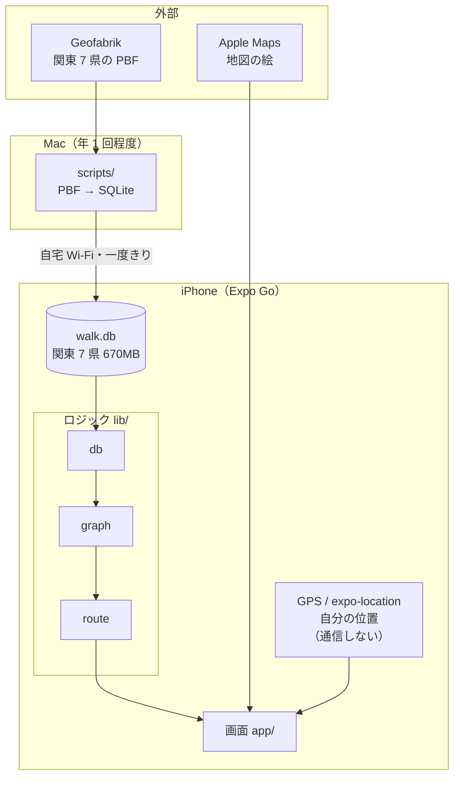
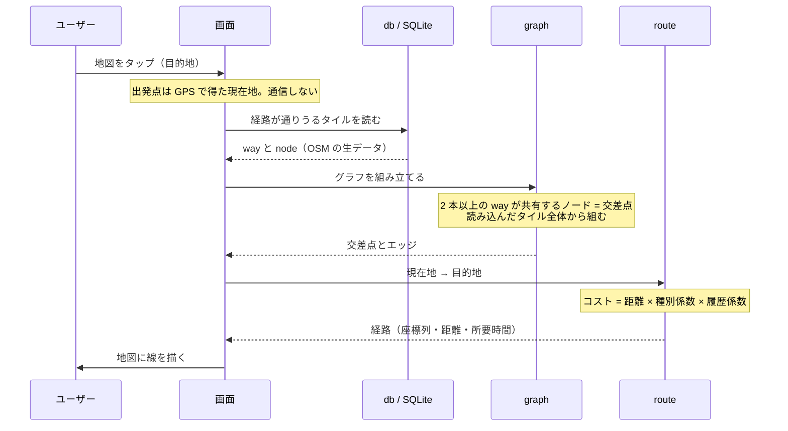

# walk-app 設計メモ

最終更新: 2026-08-08

「何を満たすべきか」は [requirements.md](./requirements.md)、作業手順は [development-plan.md](./development-plan.md) を参照。
このドキュメントは**実現方法と、そう決めた根拠となる実測データ**を扱う。

数値はすべて Overpass API で実測したもの。再取得には時間がかかるため記録として残している。

---

## 0. 全体構成

### 3 つの入力は別物

混同しやすいので先に分けておく。

| 何を得るか | どこから | 通信 |
|---|---|---|
| **自分の位置** | iPhone の GPS（`expo-location`） | **不要。** 衛星から受信するだけ |
| **経路探索に使う道路データ** | Geofabrik（Mac で前処理して投入） | 投入するときだけ |
| 画面に見える地図の絵 | Apple Maps | 表示のたび |

**関東地方の外では使えない。** 圏外で道路データを取りに行く逃げ道は設けない
（[やらないこと](./requirements.md#やらないこと)）。経路が見つからない旨を出すだけにする。

### システム構成

関東全域を Geofabrik から一括投入し、以降は端末内で完結する。
**散歩中に道路データの通信は一切起きない。**



### データの流れ



### 押さえておく点

**保存するのはグラフではなく、OSM の生の way / node。**
あるノードが交差点かどうかは「2 本以上の way が共有しているか」で決まるため、
**隣のタイルを読んだ瞬間に判定が変わる**。タイルごとにエッジを作って保存すると、
隣を足したときに辻褄が合わなくなる（[データ保存](#4-データ保存)）。

**画面に出る地図（Apple Maps）と、経路探索に使う道路網（OSM）は別物。**
取得した道路網は画面に描かれない（[画面の地図とは別のデータ](#22-画面の地図とは別のデータ)）。

**通信するのは道路網を入れるときだけで、それも自宅の Wi-Fi。**
散歩中は経路探索が端末内で完結する。
地図タイルの通信だけは Apple Maps 側で起きるが、これは[要件の対象外](./requirements.md#5-非機能要件)。

**現在地の取得に通信は要らない。** GPS は衛星から受信するだけで、
道路データとも Apple Maps とも関係しない。

### モジュールの依存

上から下へ依存する。逆向きの依存は無い。

| 層 | モジュール | 役割 |
|---|---|---|
| 画面 | `app/` | 表示と操作。ロジックは持たない |
| 探索 | `lib/route` | A\* でコスト最小の経路を探す |
| グラフ | `lib/graph` | way を交差点とエッジに変換、到達可能性 |
| 重み | `lib/cost` | 種別係数・車線補正 |
| 保存 | `lib/db` `lib/store` | SQLite との境界 |
| 座標 | `lib/tiles` | タイル ID の計算。何にも依存しない |

**外部に触るモジュールは口を型で切ってある**（`Database` / `ProbeSqlite`）。
おかげで `expo-sqlite` も通信も、実機なしでテストできる（[テストケース](./test-cases.md)）。

---

## 1. ルート提案エンジン

### 1.1 前提調査: `lanes` タグは使えない

**当初の「1 車線以下の道を優先する」は、日本ではそのまま実装できない。**

東京の住宅地 約 1.2km 四方（bbox 35.640,139.640,35.650,139.655）の実測:

| タグ | 付与率 |
|---|---|
| `lanes` | 65/760 本 (8.6%) |
| `lanes`（`highway=residential` のみ） | **1/140 本 (0.7%)** |
| `width`（道幅） | 6/760 本 (0.8%) |
| `sidewalk`（歩道有無） | 8/760 本 (1.1%) |

**避けたい対象である生活道路にこそ、車線数データが無い。**

一方 `highway` は全ての道に付いており、日本では道幅とよく対応する。同エリアの内訳:

```
footway 252 / service 178 / residential 140 / unclassified 51
tertiary 48 / primary 23 / steps 20 / secondary 17 / pedestrian 11 / path 11
```

**→ 道路種別を主指標とし、`lanes` は付いている場合のみ補助的に加味する。**

### 1.1.1 `footway` の 6 割は道路の付属物

**`footway` を 0.8 で優遇したことが、裏目に出ていた。**

関東全域 670MB の DB で武蔵小山から北へ約 10km の経路を引いたところ、
**総距離 11.96km のうち 10.51km（87.9%）が `footway`** になった。
`primary` / `secondary` は 0%。数字の上では幹線を完全に避けている。

ところが PBF 実測で `highway=footway` の内訳を数えると:

| `footway=` | 本数 | 割合 |
|---|---|---|
| （タグ無し） | 160,483 | 39.4% |
| **`sidewalk`（歩道）** | **123,729** | **30.3%** |
| **`crossing`（横断歩道）** | **121,562** | **29.8%** |
| その他 | 2,002 | 0.5% |

（`highway=footway` 全 407,776 本）

**6 割が歩道と横断歩道**、つまり車道に付随して別々に描かれた線である。
日本では大通りの歩道が `footway` として本体の way とは別に引かれているため、
**「幹線を避けた」つもりが「幹線の歩道を歩いた」になりうる。**
経路の統計に `primary` が出てこないのは、幹線本体の way を通らないからで、
物理的には大通り沿いを歩いている可能性がある。

これは[係数の調整（未決事項）](./requirements.md#7-未決事項)ではなく**データが足りない**問題だった。

#### 対処と効果（スキーマ版 3）

`footway=` を DB に持たせ（[データ保存](#4-データ保存)）、`sidewalk` を 1.5、
`crossing` を 1.0 にした。歩道が別に描かれる道路は日本ではおおむね `tertiary` 以上なので、
**「幹線沿いの proxy」として基準より不利に**してある。

同じ 2 地点（武蔵小山 → 北へ 9.71km）で引き直した結果。
3 列目は続けて[好きな道の係数を 1.0 に揃えた](#13-コストモデル)あとの値:

| | 当初（footway 0.8） | 歩道を 1.5 に | さらに係数を揃えた |
|---|---|---|---|
| `footway` | **87.9%** | 39.2% | 38.6% |
| `residential` | 5.2% | 28.5% | 25.5% |
| `unclassified` | 3.6% | 20.8% | 15.8% |
| `service` | 0% | 5.2% | 18.8% |
| `primary` / `secondary` | 0% | 0% | 0% |
| 総距離 | 11.96 km | 12.86 km | **12.15 km** |
| 直線比 | 1.23 倍 | 1.33 倍 | **1.25 倍** |
| 探索時間 | 356 ms | 588 ms | **約 500 ms** |

**歩道づたい 88% から、生活道路（`residential` + `unclassified` + `service`）60% に変わった。**

係数を揃えた効果は 2 つとも読み取れる。**遠回りが 1.33 倍から 1.25 倍に戻り**
（好きな道どうしでは距離だけで決まるため）、`service` が 5.2% → 18.8% に増えた
（1.2 の減点が無くなったため）。探索も少し速くなった。
**幹線は 3 つの状態すべてで 0%** で、目的は保たれている。

#### まだ残っていること

**`footway=` タグが無いものが最大勢力（39.4%）で、ここは好きな道と同じ 1.0 のまま。**
公園の遊歩道・参道のような**本当に歩きたい道**と、種別が書かれていないだけの歩道が
混ざっており、タグでは見分けられない。修正で確実に外せたのは
「歩道と明示されている 30.3%」だけ。

**歩道橋も抜けている。** OSM では `highway=footway` + `bridge=yes`（階段は `highway=steps`）。
実測 18,333 本（footway の 4.5%）で、うち 67.3% は `footway=` が無く 1.0 のまま。
**階段も好きな道に含めたので、歩道橋には何の不利も付かない**
（[種別係数](#13-コストモデル)）。

`bridge=yes` を使えば拾えるが、**「大通りを越える歩道橋」と「公園の池に架かる橋」を
区別できない**（橋の下に何があるかは空間的に調べないと分からない）。
避けたい道と歩きたい道が同じタグになるため、採らなかった。`bridge` は DB に保存していない。

### 1.2 探索方式: 端末内で自前実装

**外部のルーティング API は使わない。**

理由:

- [F-9](./requirements.md#f-9-ルートの多様性)（過去に歩いた区間のコストを上げる）は外部 API では表現できない。自分でコスト計算を持てば 1 項足すだけで済む
- 道路種別ごとの重み付けを自由に調整できる（実際に歩いて感覚と合うまで直したい）
- 無料・オフライン動作・API キー不要

検討した外部 API: GraphHopper は `lanes`・`road_class` による重み付けに対応するが、無料枠では使えず（flexible mode 非対応）、動的な履歴コストも表現できない。

代償として実装量は増える。狭いエリア・単純なコストから始めて、実際に歩きながら育てる。

### 1.3 コストモデル

経路のコスト = 各区間の `距離 × 種別係数 × 履歴係数` の総和。これを最小化する。

**距離をコストの基礎に置き、係数で歪める。** 距離が基礎にあるので遠回りは自然に不利になるが、
係数の側を大きく振ることで、最短性より道路種別と多様性を優先させている。

**種別係数（初期値。実際に歩いて調整する）**

| OSM `highway` | 係数 | 扱い |
|---|---|---|
| `pedestrian`, `footway`, `path`, `living_street`, `residential`, `unclassified`, `service`, `steps` | **1.0** | **歩いて気持ちのいい道。区別しない**（下記） |
| `tertiary` | 2.0 | ここから幹線道路 |
| `secondary` | 4.0 | |
| `primary` | 8.0 | 強く避けるが、通行は許容する |
| `motorway`, `trunk` | 通行不可 | 歩行者が入れない |

**幹線側の種別が何を指すか。** OSM の等級は**道幅ではなく「道路網の中での役割」**で決まる:

| 種別 | OSM の定義 | 日本での対応 |
|---|---|---|
| `primary` | 主要都市を結ぶ幹線 | おおむね国道 |
| `secondary` | やや大きな町どうしを結ぶ道路 | おおむね主要地方道（主要な県道） |
| `tertiary` | 小さな集落を結ぶ、市街地の地区中心を結ぶ道路 | おおむね一般県道・幹線的な市道 |
| `unclassified` | 上記に属さない、通り抜け機能を持つ公道 | 一般の市町村道 |

**`tertiary` が「幹線」の境目。** 日本の `tertiary` は片側 1 車線＋歩道つきで
車がそれなりに通る道が典型なので、避ける対象として妥当。

ただし OSM の等級は**行政上の路線種別に引きずられる**ため、細いのに `tertiary` の道も、
広いのに `unclassified` の道も実在する。係数はあくまで目安で、
だから[実際に歩いて調整する](./requirements.md#7-未決事項)ことにしている。

**ただし `footway` だけは種別まで見る**（`highway=footway` のときのみ）:

| `footway=` | 係数 | 扱い |
|---|---|---|
| `sidewalk` | **1.5** | **歩道。車道に付随するので好きな道より不利にする** |
| `crossing` | 1.0 | 横断歩道。避けようがないので好きな道と同じ |
| タグ無し・上記以外 | 1.0 | 公園の遊歩道・参道など。好きな道と同じ |

この細分化が必要になった経緯は
[footway の 6 割は道路の付属物](#111-footway-の-6-割は道路の付属物)。
**日本では大通りの歩道が本体の way とは別に描かれるため、
これを区別しないと「幹線を避ける」が骨抜きになる。**

#### `sidewalk` は本当に幹線の歩道か（実測）

`sidewalk` を 1.5 にした根拠は当初「歩道が別に描かれる道路はおおむね
`tertiary` 以上だから」という**推測だった**ので、測り直した。
道路側に付く `sidewalk=separate`（歩道は別線で描いてある、という宣言）の種別分布:

| 種別 | 道路総数 | `sidewalk=separate` |
|---|---|---|
| `trunk` | 23,056 | 1,618 (**7.0%**) |
| `primary` | 27,425 | 1,184 (**4.3%**) |
| `secondary` | 21,306 | 656 (**3.1%**) |
| `tertiary` | 93,945 | 1,179 (**1.3%**) |
| `unclassified` | 381,466 | 265 (0.1%) |
| `residential` | 569,041 | 126 (0.0%) |
| `service` | 514,919 | 13 (0.0%) |

**別線の歩道のうち 92.0% が `tertiary` 以上**（4,637 / 5,041）。付与率も階層を
きれいに下るので、**方向としては推測どおりだった。**

ただし 2 つ留保が付く。

- **残り 8%（404 本）は生活道路の歩道。** `residential` や `unclassified` にも
  別線の歩道はあり、**気持ちよく歩ける道なのに 1.5 の減点を受ける**。
  しかも本体の道路（1.0）より不利になる、ややねじれた扱いになる
- **標本が小さい。** `sidewalk=separate` を宣言している道路は 5,041 本しかなく、
  `footway=sidewalk` の実数 123,729 本に対して**わずか 4%**。
  このタグを書く人は大きな道路を丁寧に整備する層に偏っている可能性がある

確実に答えるには各歩道の隣にある道路を空間的に照合する必要があり、
12 万本に対しては重い。**1.5 は[歩いて判断する](./requirements.md#7-未決事項)対象に入れてある。**

**好きな道に差を付けるのはやめた。** 当初は 0.8（歩行者専用道）〜1.5（階段）に
散らしていたが、**作者はこれらをどれも同じくらい好きで、差を付ける根拠が無かった**。
揃えた利点が 2 つある。

- 好きな道どうしでは**距離だけで決まる**。好みを表さない係数のために遠回りしない
- 係数の下限が 0.8 から 1.0 に上がり、**A\* の推定値が締まって探索が速くなる**

幹線を避けるという目的には影響しない（`tertiary` 以上は据え置き）。

**階段も好きな道に含めている。** そのため**歩道橋には何の不利も付かない**
（橋げたは `footway` で、[6 割超がタグ無し](#111-footway-の-6-割は道路の付属物)）。
以前は階段の 1.5 が実質的な抑止になっていたが、それは無くなった。

**表に無い種別** — 実データには上表で網羅できない種別が少数含まれる
（1 タイルの実測で `primary_link` 9本・`cycleway` 4本・`rest_area` 1本・`corridor` 1本）。

- `*_link`（接続路）→ 接続元と同じ係数（`primary_link` なら 8.0）
- それ以外 → **1.0**（好きな道と同じ扱い。`cycleway` などは歩ける道として妥当）

**`lanes` による補正** — タグが存在する場合のみ適用（無ければ補正なし）:

- `lanes >= 2` → 係数を 1.5 倍
- `lanes <= 1` → 係数を 0.9 倍

補正後の値の例: `primary` かつ `lanes=2` → 8.0 × 1.5 = **12.0**。
1 タイルの実測では、`primary` のエッジ 199 本のうち 194 本がこの 12.0 になる。

**履歴係数** — [F-9](./requirements.md#f-9-ルートの多様性) を実現する項。[F-11](./requirements.md#f-11-歩いた道の記録) が記録した「歩いた区間」の係数を上げ、時間経過で 1.0 に戻す（2 週間程度を想定）。

| 状態 | 係数 |
|---|---|
| 未踏、または十分に時間が経った | 1.0 |
| 直近に歩いた | **3.0（上限）** |

**係数は「同種の道での迂回許容倍率」と読める。** 3.0 なら、歩いた道 100m を避けるために
未踏の道を 300m まで迂回する（種別係数が同じなら打ち消し合うため）。

ただし**ルート全体の上限ではない。** 最短ルート全体が既に歩いた道なら、新ルートは全体で 3 倍に伸び得る。
また種別係数と掛け算になるため、歩いた幹線（8.0 × 3.0 = 24）を避けて未踏の生活道路（1.0）を通る場合、
24 倍の距離まで迂回する。

上限を設けるのは、青天井だと到達不能な経路を探し続けるため。
妥当性は**実際に歩いて確かめる**（[未決事項](./requirements.md#7-未決事項)）。

**通行不可とする道**

- `highway=motorway` / `trunk` およびその `_link`
- `foot=no`
- `access=private`

**原則: 幹線道路を完全禁止にはしない。**
川・線路・高速道路で分断された地形では、幹線道路を通らないと到達できない場合がある。高コストで「やむを得ず通る」を表現する。

### 1.4 探索アルゴリズム

- ノード = 交差点、エッジ = 交差点間の道路区間、としたグラフ上の最小コスト経路探索
- ダイクストラ法、または直線距離を推定値に使った A\* 法

---

## 2. 道路網データ

### 2.1 タイルの定義

**固定サイズのタイル単位で取得し、必要に応じて増やす。**
「半径 N km を一度に取る」方式は採らない。エリアを広げるたびに全体を取り直すことになるため。

| 項目 | 値 |
|---|---|
| グリッド | 緯度・経度 **0.02度** 固定グリッド |
| タイル ID | `(floor(lat / 0.02), floor(lon / 0.02))` |
| 実サイズ | 東京付近で 約 2.2km × 1.8km ＝ **約 4.0 km²** |
| 元データ量 | OSM の生データで約 **1.0 MB**（実測） |
| 保存サイズ | 約 **0.19 MB** |

固定グリッドにすることで、タイル ID が座標から一意に決まり、取得済み判定と重複排除が単純になる。

**取得する情報:** ノード ID と座標、way のノード参照、`highway`、`lanes`、`foot`、`access`、名称

**開発時の初期エリア:** 武蔵小山付近（緯度 35.620、経度 139.700）— 品川区・目黒区の境界あたり

### 2.2 画面の地図とは別のデータ

**表示する地図（Apple Maps）と、経路探索に使う道路網（OpenStreetMap）は出所が違う。**

Apple Maps は Apple 自身が整備した地図で、OSM ではない。
本アプリが投入するのは OSM のデータで、これは画面に描かれない
（[F-1](./requirements.md#f-1-地図表示と現在地)）。

結果として次のずれが起こりうる:

- Apple Maps に描かれている道が OSM に無く、経路として選ばれない
- OSM にしか無い細い道・階段が、地図上では何も無い場所を通っているように見える
- 同じ道でも両者の座標が数 m ずれ、提案ルートの線が道の上から微妙に外れる

いずれも実害は小さいが、**「地図に道が見えているのに、そこを通らない」** という
挙動の説明がつかないと実装の不具合を疑うことになるため、記しておく。

### 2.3 タイル間の接続

**タイルをまたぐ way が切れないようにするのは、前処理の責任。**

前処理では次のように振り分ける:

- way は、**構成ノードが 1 つでも入るタイルすべて**に入れる（形状は丸ごと）
- node は、**保存した way が参照するものすべて**を入れる（タイルの外でも）

こうすると隣り合うタイルは自然に重なり合い、**OSM の way ID・node ID で
重複排除すればグラフが繋がる**。座標の浮動小数比較は要らない。

実測（0.02度タイル 1 枚、武蔵小山付近）で、この重なりがどれくらいかを確かめてある:

- way 1,806 本 / node 6,391 個
- **タイルの外にあるノード: 781 個 (12.2%)**
- **タイル境界をまたぐ way: 183 本**

**片側のタイルにしか無いノードを way が参照する形になる。**
読み出し側（`loadTiles`）は、way が参照する node をタイルに関係なく集めること。
ここが欠けると way が捨てられ、タイルが繋がらない。

### 2.4 規模の見積り

**実装後に実測し直した値**（武蔵小山タイル 1 枚 = 4.0km² で 404KB）:

| | MB/km² | 備考 |
|---|---|---|
| 当初の見積り | 0.047 | コンパクトなバイナリ表現を前提にした机上の値 |
| 最初の実装 | 0.217 | JSON でタグ一式を保存し、node ごとのタイル対応表も持っていた |
| **現在** | **0.103** | 無駄を削った後。精度は落としていない |

削ったのは 2 つ:

- **node とタイルの対応表**（`node_tiles`）— 一度も使っていなかった。全体の 3 割
- **使わないタグ** — 経路探索が読むのは `highway` と `lanes` だけ。`name` や `surface` は保存しない

座標の整数化（さらに 1 割減）とノード ID のバイナリ化（さらに数 %）も測ったが、
**丸めが入る／複雑になる割に効果が小さい**ため採らなかった。

| 範囲 | 面積 | タイル数 | 保存サイズ |
|---|---|---|---|
| 3×3 タイル（現在地の周囲） | 36 km² | 9 | 3.7 MB |
| 品川区 + 目黒区 | 37.5 km² | 約 10 | 3.9 MB |
| 半径 5km 相当 | 78.5 km² | 約 20 | 8.1 MB |
| 東京 23 区全域 | 627 km² | 約 160 | 65 MB |

**保存容量は制約にならない。** 実際の制約は**探索時のメモリ**だけ。
全タイルを同時にメモリへ載せる必要はなく、散歩の距離（数 km）なら
探索が触るのは十数タイル程度。同時に載せる上限は探索範囲を実測してから決める。

---

## 3. オフラインデータの一括投入

### 3.1 取得元: Geofabrik

**Overpass API は使わない。** 関東 7 県は 32,432 km²、タイル換算で約 8,100 枚・8 GB 相当のリクエストとなり、公共サービスの公平利用ポリシーに明確に反する。

代わりに、一括配布用に用意された Geofabrik の抽出ファイルを使う:

```
https://download.geofabrik.de/asia/japan/kanto-latest.osm.pbf   … 461 MB（実測）
```

関東地方 7 県（茨城・栃木・群馬・埼玉・千葉・東京・神奈川）が 1 ファイルにまとまっており、
**配布単位がそのまま必要範囲と一致する**ため、県境で切り出す処理が不要。

### 3.2 サイズの見積り

密度の異なる 3 地点の実測:

| 地域の性質 | 実測地点 | 密度 |
|---|---|---|
| 密集市街地 | 武蔵小山 | 469 way/km² → 0.0535 MB/km² |
| 郊外住宅地 | 所沢 | 403 way/km² → 0.0526 MB/km² |
| 山間部 | 秩父 | 6 way/km² → 0.0050 MB/km² |

**市街地と郊外はほぼ同密度、山間部は約 1/10。**

### 実際に作った結果（2026-08-08 実測）

**見積りは要らなくなった。関東全域を実際に生成した値がこれ。**

| 項目 | 実測 |
|---|---|
| way | 2,358,221 |
| node | 11,928,292 |
| タイル | 8,555 |
| **ファイルサイズ** | **670 MB**（索引込み。索引前は 636 MB） |
| 生成時間 | 469 秒（約 8 分、Node.js v22 / macOS 12） |
| 平均密度 | **0.021 MB/km²**（32,432 km²） |

PBF の way 9,766,884 本のうち歩ける道として採用したのが 2,358,221 本（24%）、
node は 60,842,984 個のうち 11,928,292 個（20%）。

**当初の見積り 2.4 GB は 3.6 倍の過大評価だった。** 原因は加重の仕方で、
[武蔵小山の 0.103 MB/km²](#24-規模の見積り) を市街地の比率に掛けていたが、
関東 7 県は面積で見ると山地・農地が大半を占める。実測の加重平均は 0.021 MB/km² で、
密集市街地の 5 分の 1 でしかない。

**この差は方針に効く。** [Expo Go で確認できているのは 900MB まで](./development-plan.md#1-4-expo-go-が-900mb-の-db-を扱えるか確かめる)で、
670 MB はその**内側に収まる**。2.4 GB なら未検証の領域に踏み込むところだった
（[環境制約](./requirements.md#環境制約)）。

### 3.3 前処理

**Mac 側で前処理を行い、完成した DB を端末に転送する。**
端末上で PBF を解析したり数百万行を挿入したりはしない（時間がかかりすぎる）。

1. Mac で `kanto-latest.osm.pbf` を取得
2. Mac で歩行道路のみを抽出し、[タイル](#21-タイルの定義)に分割して SQLite DB を生成
3. Mac でローカル HTTP サーバを立て、アプリが自宅 Wi-Fi 経由で DB を取得する

**実装言語は Node.js。** このプロジェクト自体が Node であり、純 JS の PBF パーサが使えるため。
Python は使えない（→ [開発環境](#5-開発環境)）。前処理スクリプトは `scripts/` に置き、アプリ本体とは分離する。

**タイル方式との関係:** 一括投入は「同じテーブルにまとめて書き込む」だけであり、
**アプリ側の経路探索・タイル管理は一切変更しない。**

### 3.4 更新の頻度

**定期更新は必須ではない。年 1 回程度で十分。**

同一タイル（武蔵小山、0.02度）の way 集合を過去時点と比較した実測:

| 期間 | 追加 | 消滅 | 変化なし |
|---|---|---|---|
| 直近 1 年 | +50 (2.8%) | −8 (**0.5%**) | 1,756 (99.5%) |
| 直近 3 年 | +232 (14.5%) | −28 (**1.7%**) | 1,574 (98.3%) |

判断の根拠は**消滅率の低さ**にある。古いデータで困るのは「実在しない道を提案してしまう」場合だが、
それが起きるのは消えた way に限られ、年 0.5%（3 年でも 1.7%）に留まる。

追加側の 2.8%/年 は「新しくできた道」ではない点に注意。
既存の道が新たにマッピングされたケースや、way が分割・再描画されて新しい ID が振られたケースを含むため、
実際に増えた歩ける道はこれより少ない。

**更新の手順:** [前処理](#33-前処理)をもう一度実行して DB を作り直し、転送し直すだけ。
Geofabrik の抽出ファイルは**ほぼ毎日更新されている**（実測: 取得の 1 日前が Last-Modified）。

### 3.5 更新に耐える ID 設計

**[F-11](./requirements.md#f-11-歩いた道の記録) の記録は、OSM の way ID・node ID で保持する。**
内部で振った連番 ID で持つと、DB を作り直すたびに対応が崩れ、**地図更新のたびに記録が消える**。

OSM ID なら、上表の通り 3 年で 98.3% の way がそのままなので、更新をまたいでも履歴が生き残る。

---

## 4. データ保存

保存するデータは 2 種類:

1. 道路網グラフ — タイル単位。1 タイルあたり way 約 1,800 本
2. 歩いた区間の記録 — 区間 ID と日時

**`expo-sqlite` を採用する。**

理由: 道路網がタイル単位で増えていくため、「必要なタイルだけ読み込む」「タイル単位で削除する」という部分的な読み書きが必須。`AsyncStorage` は Key-Value 全体の読み書きになるため合わない。

タイルを Key とした Key-Value でも成立はするが、[F-11](./requirements.md#f-11-歩いた道の記録) の「歩いた区間」を区間 ID で引く操作もあるため、最初から SQLite にしておく。

---

## 5. 開発環境

### 使えるもの・使えないもの

| ツール | 可否 |
|---|---|
| **Node.js v22.23.2** | **使える。前処理はこれで実装する** |
| Python | 使えない（3.7 系のため pyosmium がビルド不可） |
| Homebrew | 使えない（macOS 12 で formula がエラー。`osmium` 等が入らない） |
| Xcode | 未インストール。macOS 12 では 16.1 以上が入らない |
| gh CLI | 公式ビルド済みバイナリを `~/.local/bin/gh` に配置済み |

### ネイティブビルドができない理由

| 項目 | 現状 | Expo SDK 54 の要求 |
|---|---|---|
| macOS | 12.7.6 (Monterey) | Xcode 16.1 のために 14 以上が必要 |
| Xcode | 未インストール（Command Line Tools のみ） | 16.1 以上 |

**解消するには（将来必要になったら）:**

1. macOS を 14 以上にアップグレードし Xcode 16.1 以上を入れる
2. EAS Build を使う。ただし実機用の開発ビルドには Apple Developer Program（年 $99）が必要

要件への影響は [requirements.md](./requirements.md#環境制約) を参照。

### 採用ライブラリ

| 用途 | ライブラリ | 備考 |
|---|---|---|
| 地図表示 | `react-native-maps` | iOS は Apple Maps。API キー不要。Expo Go で動く |
| 位置情報 | `expo-location` | フォアグラウンド取得のみ使う。Expo Go で動く |
| 保存 | `expo-sqlite` | |
